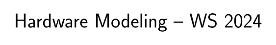

<div align="center">


<p>
Florian Huemer, Sebastian Wiedemann, Dylan Baumann
</p>
</div>


[[_TOC_]]


Welcome to the HWMod assignment repository!

Throughout the semester you will find the homework for all three chapters in here.
The tasks of each homework are designed to challenge your understanding of VHDL and hardware description and enhance your problem-solving skills.
The work you do here will directly prepare you for the Digital Design and Computer Architecture lab next semester.


# Collaboration Policy

Please keep in mind that the main purpose of the homework is to give you the opportunity to **practice** programming in VHDL and describing hardware.
The skills you will gain by doing the tasks are vital for the Digital Design and Computer Architecture lab.
It is therefore in your best interest to try to solve the tasks yourself.
Of course, it is allowed (and even encouraged) to talk to your colleagues, discuss ideas, and to seek assistance from AI while working on solutions.
However, keep in mind that during the presentation of your submission, you will only have access to your submission and you thus will have to rely solely on your own knowledge and understanding.

Be aware that we will use a plagiarism-checker to cross-check all submissions.
Cheating, of any kind, will lead to a negative grade on the course (irrespective of points you might have achieved already).
See the [Plagiarism Policy](https://www.tuwien.at/mwbw/im/ao/lehre/abschlussarbeiten/plagiarismus) of TU Wien and the [Introduction Slides](https://owncloud.tuwien.ac.at/index.php/s/TAz5MgVZwTyLIWQ/download) for more details.

# Structure of this Repository

The root directory of this repository contains the following sub-folders.

* `lib`: Here we store library modules and packages that will be used throughout the course. **Don't make any changes here**.
* `util`: This folder contains Makefile templates, used to build and simulate your code. **Don't make any changes here**.
* `chapterX`: The tasks for each chapter `X` are located in here. Your own code (i.e., your solutions) also goes here.
* `demos`: The examples we present during the demonstration sessions can be found in here.

# First Steps

## Clone the Repository
Be sure to use `git` to actually clone this repository.
**Do not** just download it as an archive, because we will push updates during the semester and you will have a hard time tracking the changes otherwise.

## Retrieve your TILab Account
To retrieve your TILab account go to [password.tilab.tuwien.ac.at](https://password.tilab.tuwien.ac.at) and login with your TISS credentials.
Should you forget your TILab password, you can also reset it using this site.

Note that the usernames for Hardware Modeling start with the letter `m`.

## Download the VM
If you want to work on your own computer, we recommend downloading our (Virtual Box) VM image from the TILab server.
To do that you can either go to the TILab and copy the image to a USB stick or use the following command.

```bash
scp USERNAME@ssh.tilab.tuwien.ac.at:/opt/eda/vm/ECS-EDA-Tools-VM.tar.xz .
```

`USERNAME` is your TILab username you got in the previous step.

To extract the archive use the following command (under Windows you can use e.g., [7-zip](https://7-zip.org/).):

```bash
tar -xf ECS-EDA-Tools-VM.tar.xz
```

The root/user password for the VM is `ecseda`.
You can change it using the `passwd` command.

On a Linux host system the VM can also be used with libvirt-based tools, like [GNOME Boxes](https://apps.gnome.org/Boxes/) or [virt-manager](https://virt-manager.org/).
For older versions of GNOME Boxes it might be necessary to first convert the virtual disk image (`ECS-EDA-Tools.vdi`) to a different format:

```bash
qemu-img convert -f vdi -O qcow2 ECS-EDA-Tools.vdi ECS-EDA-Tools.qcow2
```


# Task Overview

## Chapter I

| task | Points | Keywords (Topics) |
|-|-|----|
| [alu](chapter1/alu/task.md) | 1 | combinational, arithmetic operations |
| [illusions](chapter1/illusions/task.md) | 1 | control flow, vhdldraw |
| [bin2dec](chapter1/bin2dec/task.md) | 2 | arithmetic operations, unconstrained types |
| [structural_adder](chapter1/structural_adder/task.md) | 1 | structural modeling, combinational |
| [creative](chapter1/creative/task.md) | 1 | vhdldraw, control flow |

## Demonstration I

| task | Points | Keywords (Topics) |
|-|-|----|
| [fulladder](demos/demo1/fulladder/task.md) | - | behavioral modeling, testbench |
| [vectoradder](demos/demo1/vectoradder/task.md) | - | testbench, control flow |

